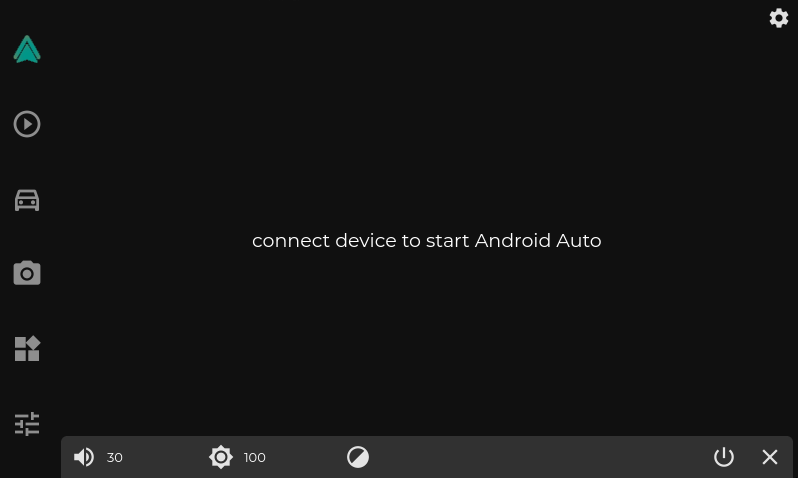

# OpenDash

OpenDash is a Qt-based infotainment center for your Linux OpenAuto installation!
The OpenDash project includes OpenAuto, AASDK, and Dash.

Main features of Dash include:

*	Embedded OpenAuto `Windowed/Fullscreen`
*	Wireless OpenAuto Capability
*	On-screen Volume, Brightness, & Theme Control
*	Responsive Scalable UI `Adjustable for screen size`
*	Bluetooth Media Control
*	Real-Time Vehicle OBD-II Data & SocketCAN Capabilities
*	Theming `Dark/Light mode` `Customizable RGB Accent Color`
*	True Raspberry Pi 7” Official Touchscreen Brightness Control
*	App-Launcher built in
*	Camera Access `Streaming/Local` `Backup` `Dash`
*	Keyboard Shortcuts `GPIO Triggerable`



# Getting Started

## Video walk through
_steps may be slightly different such as ia (intelligent-auto) has been renamed to dash, the UI has changed, etc..._

https://youtu.be/CIdEN2JNAzw

## Install Script

Dash can be built automatically utilizing an included script.

The install script included in the dash repo will install all the required packages and compile all portions of the OpenDash project.

### 1. Clone the repo, Run the install script
```
git clone https://github.com/openDsh/dash

cd dash

./install.sh
```
