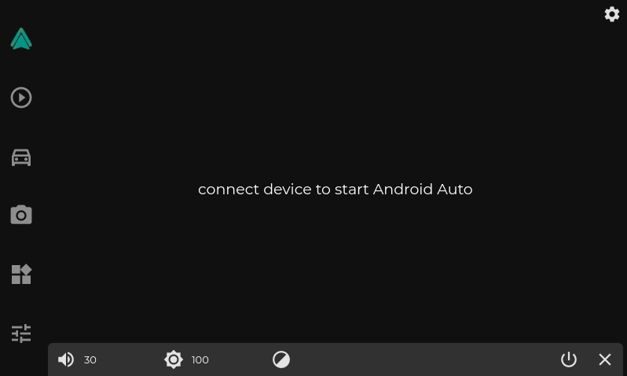

# OpenDash

OpenDash is a Qt-based infotainment center for your Linux OpenAuto installation!
The OpenDash project includes OpenAuto, AASDK, and Dash.

Main features of Dash include:

*	Embedded OpenAuto `Windowed/Fullscreen`
*	Wireless OpenAuto Capability
*	On-screen Volume, Brightness, & Theme Control
*	Responsive Scalable UI `Adjustable for screen size`
*	Bluetooth Media Control
*	Real-Time Vehicle OBD-II Data & SocketCAN Capabilities
*	Theming `Dark/Light mode` `Customizable RGB Accent Color`
*	True Raspberry Pi 7” Official Touchscreen Brightness Control
*	App-Launcher built in
*	Camera Access `Streaming/Local` `Backup` `Dash`
*	Keyboard Shortcuts `GPIO Triggerable`



## Getting Started

Dash is built with the repository flake. The supported entrypoints are:

```sh
nix develop
nix flake check --print-build-logs
nix build .#dash --print-build-logs
```

After a successful package build, the executable is available at:

```sh
./result/bin/dash
```

## Raspberry Pi Image

The flake also defines a Raspberry Pi 4 NixOS image for a head-unit style deployment:

```sh
nix run .#make-images
```

Compressed image artifacts are copied to:

```sh
dist/images/*.img.zst
```

## Flake Outputs

The initial Nix surface is intentionally small:

- `devShells.default`
- `packages.dash`
- `checks.dash`
- `apps.make-images`
- `nixosConfigurations.pi4-headunit`
